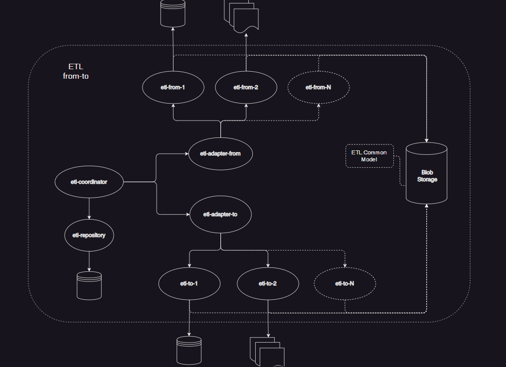
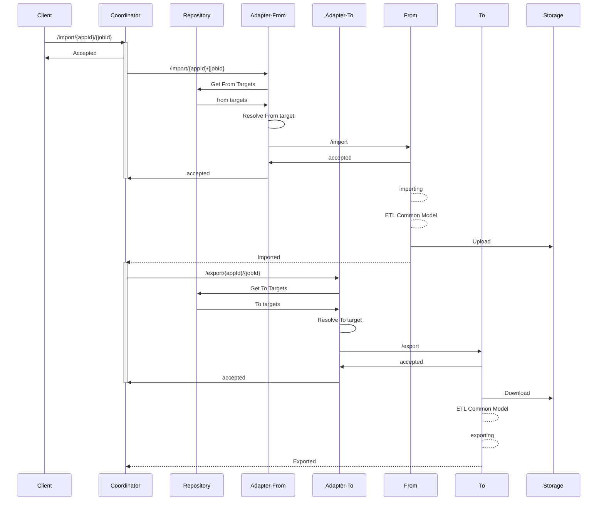

# cat-email

 

## Flow

```mermaid
sequenceDiagram
    participant Client
    participant Coordinator
    participant Repository
    participant Adapter-From
    participant Adapter-To
    participant From
    participant To
    participant Storage


    Client->>Coordinator: /import/{appId}/{jobId}
    activate Coordinator
    Coordinator->>Client: Accepted
    Coordinator->>Adapter-From: /import/{appId}/{jobId}
    Adapter-From->>Repository: Get From Targets
    Repository->>Adapter-From: from targets
    Adapter-From->Adapter-From: Resolve From target
    Adapter-From->>From: /import
    From->>Adapter-From: accepted
    Adapter-From->>Coordinator: accepted
    deactivate Coordinator

    From-->From: importing
    From-->From: ETL Common Model
    From->>Storage: Upload
    From-->>Coordinator: Imported

    activate Coordinator
    Coordinator->>Adapter-To: /export/{appId}/{jobId}
    Adapter-To->>Repository: Get To Targets
    Repository->>Adapter-To: To targets
    Adapter-To->Adapter-To: Resolve To target
    Adapter-To->>To: /export
    To->>Adapter-To: accepted
    Adapter-To->>Coordinator: accepted
    deactivate Coordinator

    To->>Storage: Download
    To-->To: ETL Common Model
    To-->To: exporting
    To-->>Coordinator: Exported

```

