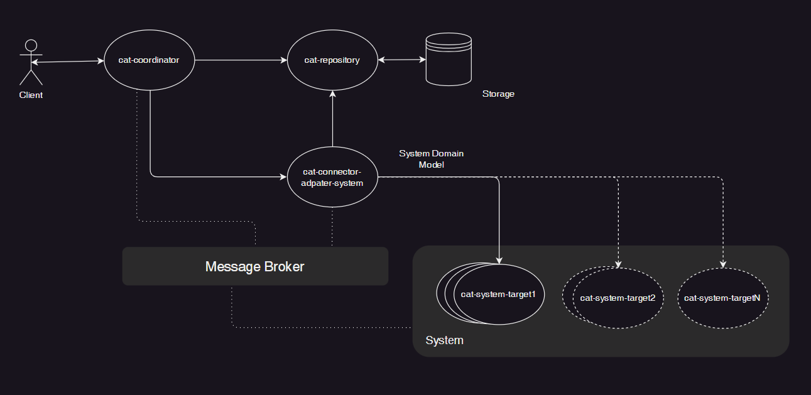
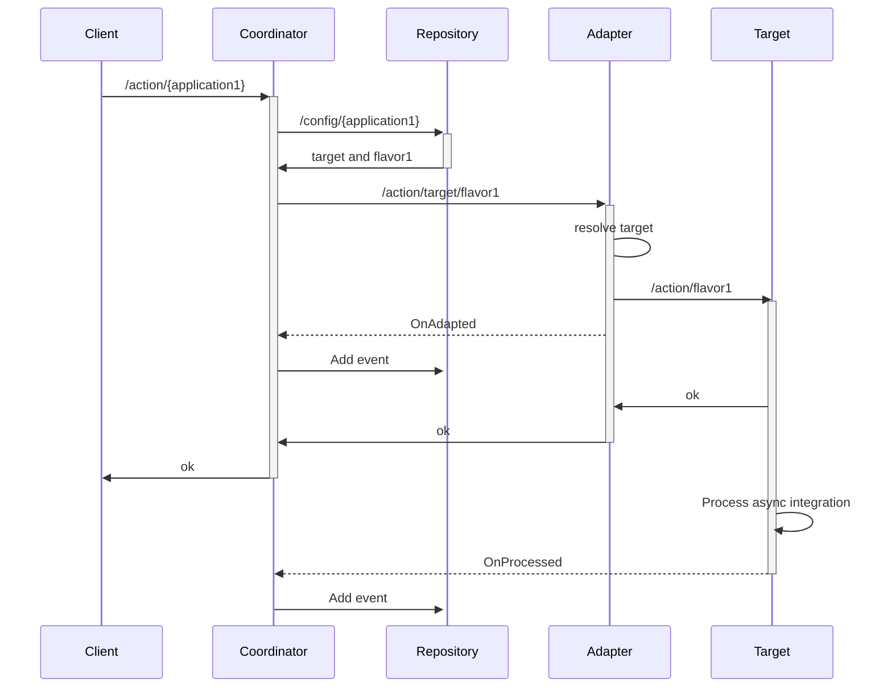

# Coordinator Adapter Target

## abstract
A bunch of micro services cooperating each other to reach third party integration scalability.

A connector is a single microservice able to connect to a defined **target** in order to implement the related integration logic.

We can add connectors to the domain just following the steps:
- creating a new micro service to handle the integration
- including the new target in the domain changing the adapter configuration
- configuring the target's `flavor` in the repository

 

## architecture

 

 

## flow

 

 

## cat-coordinator
 

The coordinator micro service is the "orchestrator" for the entire logic in the CAT domain. The coordinator is similar to the __SAGA__ pattern orchestrator.
 

It acts as entry point for the exposed RESTful api and it is responsible to retrieve information from repository to handle the incoming request.
 

Using the parameter `applicationId` we can retrieve __target__ and __flavor__ data to call the adapter.
- __target__ identify a kind of integration
- __flavor__ are the settings allowed by the selected target

 

> Usually the coordinator subscribes to events in order to handle notifications coming form all the other microservices.
 
The coordinator should be able to store data in the repository using the `event sourcing` pattern.

 

## cat-repository
 

The repository micro service is a basic CRUD service.

 

## cat-adapter
 

The main purpose of the adapter micro service is to resolve the right target to perform the action.
 
Once the target was resolved the adapter will call it using the __flavor__ parameters.
 
For each target we can have different flavor representing different target options.
 

## cat-target
 

The target micro service is responsible to implement the right third party integration.

 

## use cases

[cat-pay](./cat-pay.md)
 

[cat-export](./cat-export.md)
 

[cat-email](./cat-email.md)